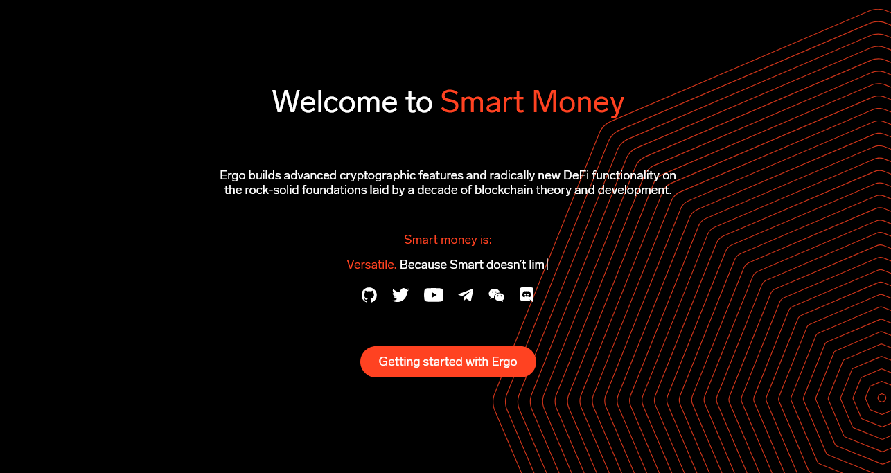

# ERGO Website

[](https://ergoplatform.org/)
**Ergo builds advanced cryptographic features and radically new DeFi functionality on the rock-solid foundations laid by a decade of blockchain theory and development.**

## To Do

* Need latest version nodejs and yarn.
* Need Hugo [0.55.4](https://github.com/gohugoio/hugo/releases) or later
* Need Yarn setup

### Yarn setup

```sh
$ yarn install
```

### Up server on localhost:1313

```sh
$ make server
```

### Watch assets js

```sh
$ yarn run watch
```

### Build site

```sh
$ make site
```

## Social Media


