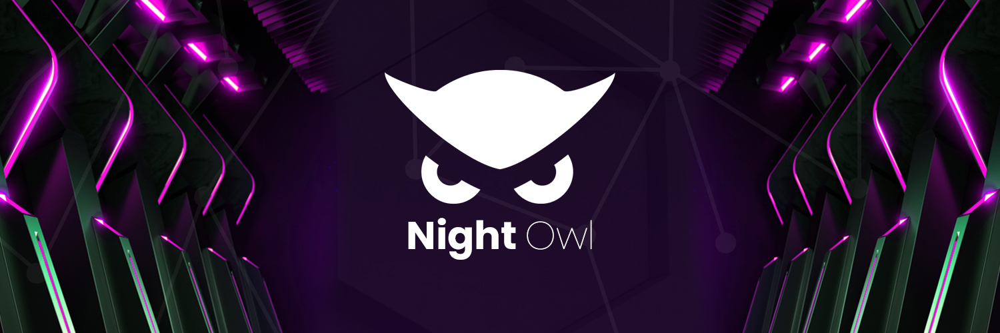

>*Night Owl aims to harness Ergo’s capabilities to recreate the casino industry utilizing a unique approach that will remove centralization and integrate transparency & fairness as its core values.*

By closely following the Ergo Manifesto, Night Owl aims to revolutionize the casino industry. The big goal is being undertaken by a special team—the community.

This endeavor is entirely open-source and is attempting to improve upon the traditional methods of the casino industry. Night Owl plans on doing this by removing the central authority and allowing everyday people to become ‘the house,’ earning passive returns.

“Anyone can provide OWL to a liquidity pool that will act as the funds for the games. If a user plays roulette and wins, the payout would be taken from this pool and given to the user. If they lose? The payout goes to the liquidity pool and is split between liquidity providers. Casino games are built with a slight edge to the house, meaning that over time, ‘the house always wins.’ This method provides the opportunity for liquidity providers to gain passive returns.”

The best thing about these passive returns? They’re stable, meaning that there is no risk associated with the loss of value of a token. This will be done by pegging Night Owl’s token, the OWL, to stablecoins. Initially, it will be Ergo’s SigUSD. This is excellent news for SigUSD as it provides newfound utility to the coin, as was intended since its inception. However, they plan to offer different stablecoins as they become available on the Ergo Platform through various bridges. Night Owl users will be able to use the stablecoin of their choosing. 

Night Owl’s peg to SigUSD provides the additional benefit of a fair tokenomics, following the Ergo Manifesto Ideology. Like Ergo, Night Owl will not organize presales, IDO, team allotment, etc. The platform's development and growth are sustained through fees taken from revenue generated by the games.

If this weren’t enough, Night Owl would be fully transparent by providing the odds of each game on the platform. No more wondering if the game is rigged, as anyone can verify all the contracts and the random number generation through their open-source code.

--------------------------------------------

Recently, Night Owl has announced its first four games — ‘The Pioneers.” They will be: 

- Roulette
- [Lottery](https://twitter.com/NightOwlCasino/status/1511395465371209730)
- [CoinFlip](https://twitter.com/NightOwlCasino/status/1492270496536166404)
- Blackjack

More information on the games is available [here](https://medium.com/@NightOwlCasino/the-pioneers-night-owls-first-four-games-31dc6406a5f8)!

Night Owl has started collaborating and integrating other Ergo projects into the mix. They will launch with integration to the wallets of Nautilus, SafeW, and Ergo Pay, allowing a user to choose which wallet they prefer. Artwork from the popular ERGnome team has also been seen in Night Owl. An ERGnome character can be seen in the theme for each of the initial four games. 

The Night Owl platform will also be open to third-party developers. As a developer, you will be able to fill out a form to integrate into the platform, subject to auditing for fairness. Night Owl will incentivize third-party development by allowing developers to take a percentage of the revenue their game creates.

The team has mentioned their aspirations for the platform’s future in their [Litepaper](https://medium.com/@NightOwlCasino/litepaper-7c360b2cff7). The group aims to tackle various goals. This includes becoming multi-chain and developing different gaming areas like sports booking and P2P bets. 

The Ergohack III team has much to offer and much more to come. Their targeted roadmap date is July 2022. This launch of v0.1.0 aims to include swap, liquidity provisioning, and The Pioneers game collection.  

For more information and to stay up to date, the Night Owl’s coming soon page is now up with links to their respective socials: https://nightowlcasino.io/. 

